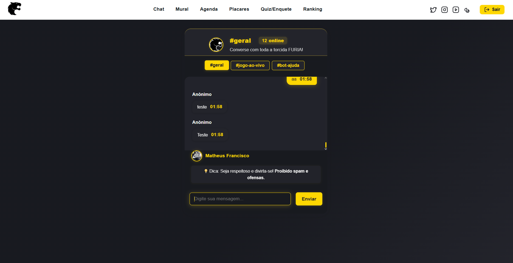
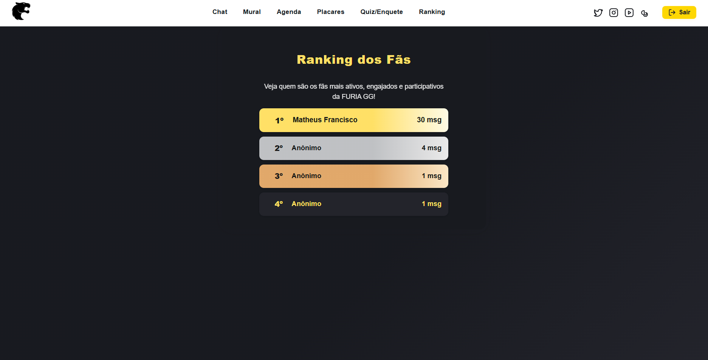
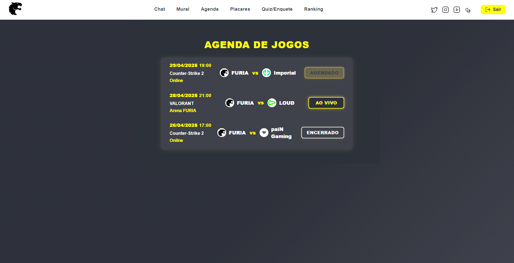
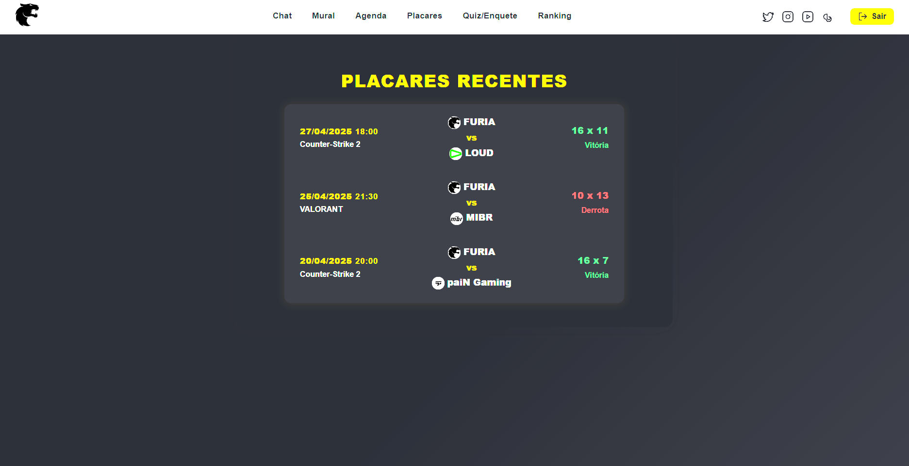
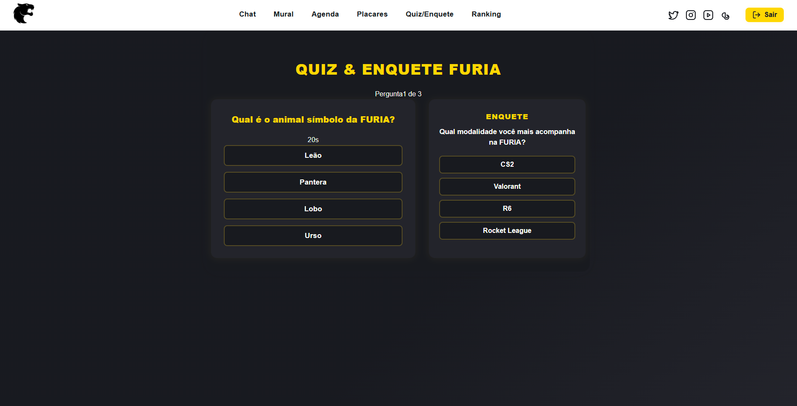
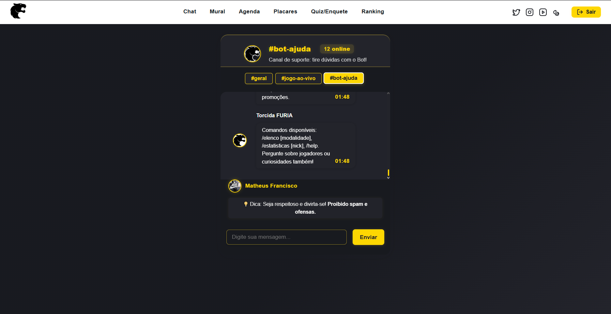

# FURIA Fan Chat

Bem-vindo ao chat interativo de fãs da FURIA GG! 🦁🔥  
Aqui você acompanha jogos, consulta estatísticas, interage com outros fãs e recebe informações em tempo real de todas as modalidades da FURIA GG (CS, Valorant, Rocket League, Rainbow Six, Kings League, e muito mais).

[🔗 Acesse a versão online (Vercel)](https://challenge1-furia.vercel.app)

---

## 📚 Tecnologias Utilizadas

| Camada     | Tecnologia                |
|------------|---------------------------|
| Frontend   | React + Vite              |
| Backend    | Firebase (Firestore/Auth) |
| Deploy     | Vercel                    |
| Estilo     | CSS customizado           |

---

## 🚀 Funcionalidades Principais

- Chat global em tempo real (Firebase)
- Tela de login moderna: escolha entre Google ou Anônimo
- Autenticação obrigatória: só usuários autenticados acessam o chat
- Modais para agenda de jogos e placares recentes (acesso fácil pela interface)
- Quiz e Enquete interativos com feedback sonoro
- Ranking dos fãs mais ativos com badges e XP
- Comandos inteligentes para fãs (veja abaixo)
- Status de jogos ao vivo (mock)
- Experiência reativa: após login, acesso imediato ao chat
- Logout seguro: ao sair, retorna para a tela de login
- Código limpo, sem variáveis ou funções não utilizadas
- Tratamento robusto de erros e mensagens orientativas
- Áudio local para feedback do quiz em `/frontend/public/sounds/error.mp3`
- Organização dos componentes e melhores práticas de React

---

## 💬 Comandos do Chat

| Comando                       | O que faz                                             | Exemplo                   |
|-------------------------------|-------------------------------------------------------|---------------------------|
| `/elenco [modalidade]`        | Mostra elenco de uma modalidade                       | `/elenco csgo2`           |
| `/estatisticas [nick]`        | Estatísticas de um jogador                            | `/estatisticas art`       |
| `/modalidades`                | Mostra modalidades disponíveis                        | `/modalidades`            |
| `/curiosidades [modalidade]`  | Curiosidades sobre uma modalidade                     | `/curiosidades valorant`  |
| `/help` ou `/comandos`        | Lista todos os comandos                               | `/help`                   |

> ⚡ **Agenda de jogos e placares recentes acessíveis via botões na barra lateral!**

---

## 🛠️ Como rodar localmente

### Pré-requisitos
- Node.js >= 18
- Conta no Firebase ([crie aqui](https://console.firebase.google.com/))

### Passos
1. Clone o repositório
2. Instale as dependências em `/frontend` e `/backend`:
   - `cd frontend && npm install`
   - `cd ../backend && npm install`
3. Configure o Firebase em `/frontend/.env` (use o exemplo `.env.example`)
4. Rode o frontend:
   - `cd frontend && npm run dev`
5. (Opcional) Rode o backend:
   - `cd backend && npm start`
6. Adicione o efeito sonoro em `frontend/public/sounds/error.mp3`

### Observações
- Login é obrigatório.
- Se o login via Google falhar, verifique bloqueadores de popup.
- Erros 400 ou `ERR_BLOCKED_BY_CLIENT` ao sair são esperados.

---

## 📡 Arquitetura e Backend

O frontend está 100% funcional com Firebase, **sem necessidade de backend próprio**.  
Entretanto, há um backend Node.js pronto para futuras integrações.

### Exemplos de rotas (opcional)
- `GET /api/elenco/:modalidade`
- `GET /api/jogos`
- `GET /api/placares`
- `GET /api/modalidades`
- `GET /api/estatisticas/:jogador`
- `GET /api/curiosidades/:modalidade`
- `GET /api/noticias`

---

## 🖼️ Demonstração

### Prints do Sistema

### Tela de Login

### Página Inicial

### Chat em funcionamento

### Ranking dos Fãs

### Mural de Recados

### Página de Placar

### Modal de Agenda

### Página de Quiz/Enquete

### Interação com o Bot

### Vídeo de Demonstração
[🔗 Link para vídeo (YouTube ou Drive)](URL_DO_VIDEO)

---

## 📱 Mobile: Em desenvolvimento!

A interface já funciona em dispositivos móveis, mas melhorias de usabilidade estão em andamento.

---

## 🧹 Boas Práticas e Manutenção

- Código limpo e organizado
- Componentes reutilizáveis
- Boas práticas de React aplicadas
- Tratamento de erros para melhor experiência
- Feedback sonoro local configurável

---

## 🌟 Expansão futura

- Canais temáticos
- Ranking de fãs (XP e níveis)
- Integração com APIs de e-sports oficiais
- Reações e perfis customizados
- Backend online com dados em tempo real

---

## 📄 Licença

MIT

---

**Desenvolvido por fãs, para fãs!**  
[🔗 LinkedIn do Autor](https://www.linkedin.com/in/matheusfranciscols)